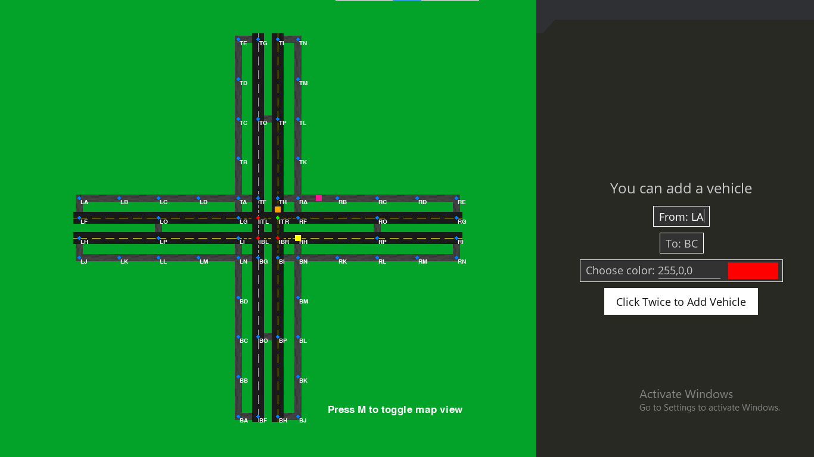

# Traffic/Routing Simulator using `pygame`

- Language: Python
- UI Library: pygame & pygame-menu
- How to run? Run the `main.py` file after running `pip install pygame pygame-menu`
- Features (so far):
  - **2D map** containing main roads and service roads
  - **Traffic monitoring** (if you toggle map view, red edges are shown where traffic is high).
  - Finding **shortest route** while taking **traffic** into consideration
  - Functioning **traffic lights** at intersection
  - Can **toggle view** between edge mode and road mode by pressing `M`
  - Can **add new vehicles** by selecting desired locations and color
- UI (so far):
  

### Read this if you think there is a bug

- Cars are allowed in this app to go over each other. Multiple cars can stop at a vertex
- Due to the above point, traffic is affected
