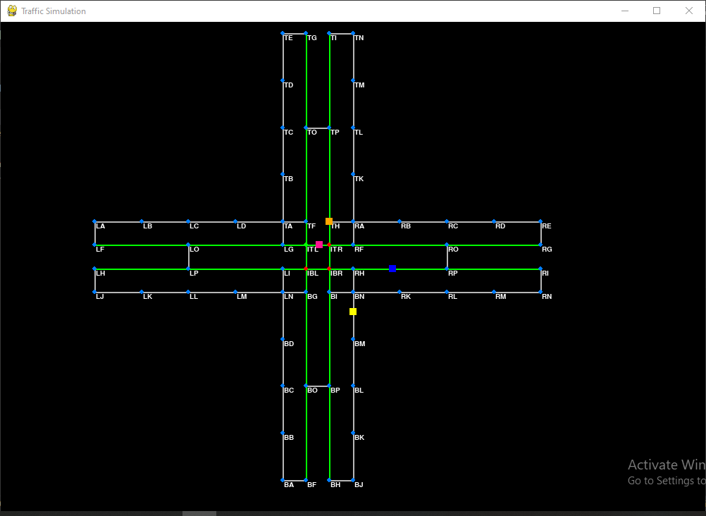
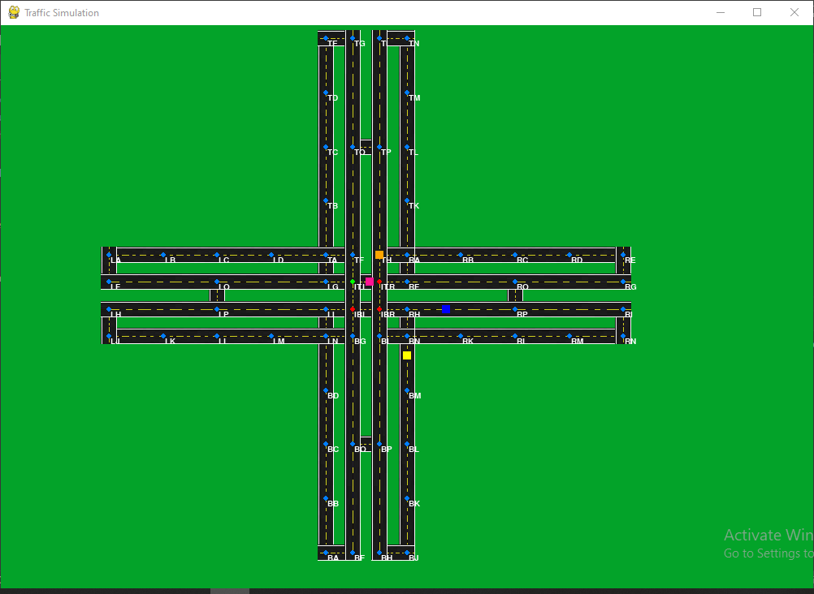

# Traffic/Routing Simulator using `pygame`

- Language: Python
- UI Library: Pygame
- How to run? Run the `main.py` file
- Features (so far):
  - 2D map of vertices and edges (main roads and service roads) using `graph` data structure
  - Finding **shortest route** using `Dijkstra Algorithm` using `priority queue`
  - **Traffic lights** and stopping at traffic lights
  - Switch by clicking `M` the map display layout between **edge mode** and **road mode**
- UI (so far):
  
  
